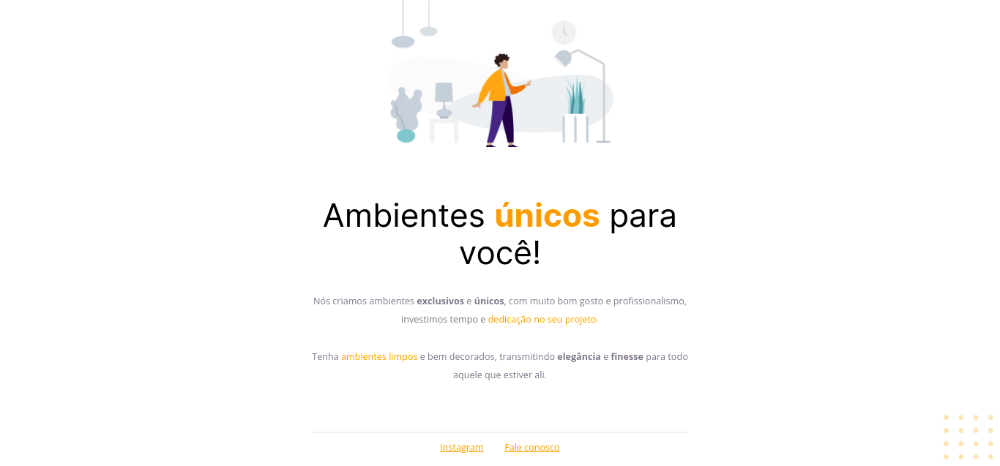

# Corrigindo bugs 01 - Stage 02 (Explorer)

### Linguagens usadas: HTML e CSS

=> Nesse desafio recebemos um código quebrado e nossa missão é consertá-lo e deixar do jeito que está no projeto do Figma.

## Projeto quebrado

##
 

## Projeto finalizado

